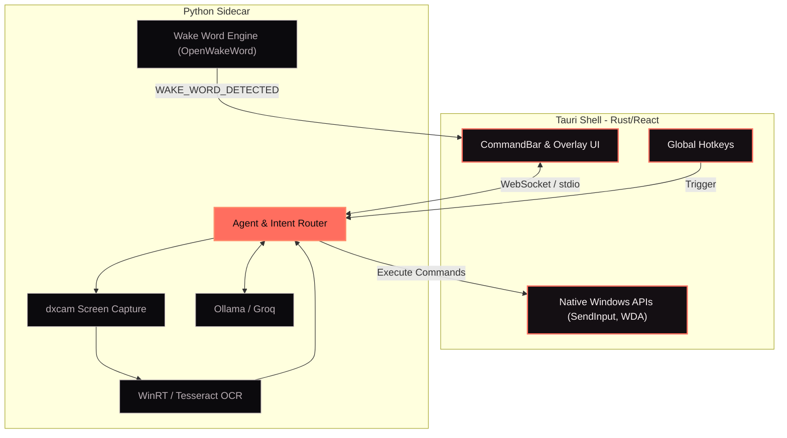
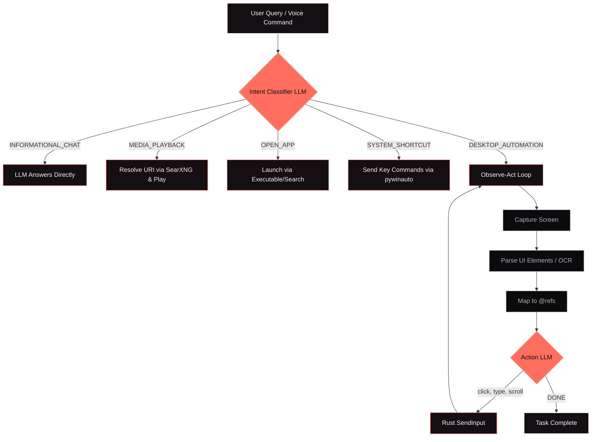
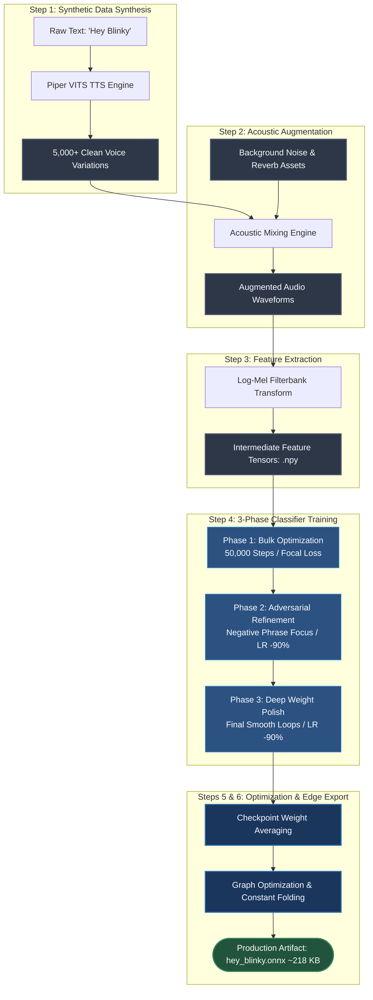
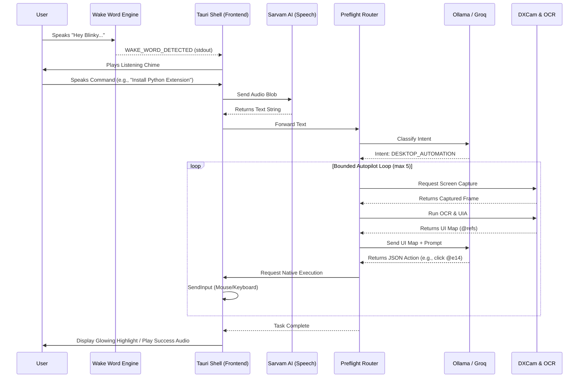

# Blinky Project Documentation

## 1. App Overview

**Blinky** is an offline-first, privacy-respecting AI desktop tutor and agent. It is designed to solve "tutorial hell" by teaching users how to navigate complex software directly on their screen, or by taking control to perform tasks automatically via a safe autopilot loop.

### 1.1. Core Value Proposition
- **Screen Tutor Mode**: Captures the active screen, applies OCR and Window UI Automation, and leverages local or cloud LLMs to provide step-by-step visual guidance with a glowing overlay.
- **Agent Mode (Autopilot)**: Executes tasks autonomously—from opening apps and playing Spotify tracks to executing complex multi-step UI navigation (typing, clicking, scrolling) via a bounded autopilot loop.
- **Privacy-First**: Designed to run primarily with local models (Ollama) and local search (SearXNG) without sending sensitive screen data to the cloud unless explicitly configured.

### 1.2. Key Features
- **Real-Time Word Highlighting**: Integrates with Sarvam AI for TTS (Text-to-Speech) and STT (Speech-to-Text), dynamically highlighting text on screen in sync with the audio readback.
- **Preflight Intent Classification**: Fast routing to determine if a query requires screen capture, app launching, media playback, system shortcuts, or just an informational response.
- **Flicker-Free Overlay**: Uses advanced Windows API display affinity to ensure the AI's overlay is invisible to the screen capture mechanism, preventing a feedback loop while remaining visible to the user.
- **Dynamic App Context**: Automatically generates navigation guides for new applications on the fly by querying local search and using LLMs to structure the data.

## 2. Problem Statement & Domain

Learning complex software (like VS Code, Blender, or system configurations) typically involves a lot of context switching between tutorials, videos, static documentation, and the active application. This creates "tutorial hell", causing friction and slowing down software onboarding. 

### 2.1. The Pain Points
- **Context-Switching:** Users constantly alt-tabbing between a tutorial and their workspace.
- **Pacing Issues:** Video tutorials are often too fast or too slow, and static text manuals lack visual context mapping.
- **Cognitive Load:** Manually mapping a text instruction (e.g., "Click the extensions icon") to a visual element on screen is mentally taxing for beginners.

### 2.2. The Solution
Blinky brings the learning experience *directly* into the active application. It acts as an over-the-shoulder tutor by capturing the screen, running local OCR + Windows UIA, and utilizing AI to provide real-time visual highlights exactly where the user needs to look or click. 

## 3. Evolution of the App

The development of Blinky progressed through several rapid iterations and major feature additions. Here is the timeline of how everything came together from idea to execution:

- **Mid-June 2026 - Project Scaffolding & Core TTS:** The project underwent a massive reorganization to cleanly separate the Rust platform shell from the Python backend. The Sarvam TTS integration was finalized, establishing the critical real-time word-level text highlighting on the screen.
- **Late-June 2026 - UI Revamp & Cross-Platform Hardening:** The chatbar UI was completely restructured to resemble modern assistants (like Copilot/ChatGPT) with manual read-aloud controls. Cross-platform compatibility was hardened, dynamically adjusting overlay positions on Linux and resolving Windows dependencies.
- **Late-June 2026 - Agent Automation Expansion:** Focus shifted to the "Agent Mode". YouTube and Spotify playback integrations were added. A mobile companion app interface was initialized over WebSockets, and OmniParser was introduced for robust screen element detection. The Wake Word engine was heavily optimized to reduce latency and expose granular decision metrics.
- **Early-July 2026 - Hardening & Intent Routing:** Fixes were deployed to improve click confidence and the open-app intent routing system. Complex flows, like the WhatsApp session management (logging out, clearing cache, and regenerating QR codes), were deeply refined.
- **Mid-July 2026 - The "Ember" Visual Polish:** The final development sprint focused intensely on the application's visual identity. Intense edge lighting and outer glows were refined, cursor-based UI interactions were added, and the light pink/coral "Ember" theme colors were restored, giving Blinky its signature premium, dynamic dark-glass look.

## 4. Design System & Theming

The Blinky application employs a modern, premium, and highly dynamic **Dark Mode** aesthetic. The design relies heavily on "glassmorphism" (translucent panels with background blurs), vibrant neon-like accents, and dynamic ambient lighting effects.

### 4.1. Color Palette
The color scheme is rooted in deep, rich dark tones contrasted with energetic, warm accents to create a visually striking interface.

*   **Backgrounds (Deep Dark):**
    *   Base Background (`--bg-0`): `#0b0a0d` (Very dark, near-black purple/grey)
    *   Secondary Background (`--bg-1`): `#140f13`
*   **Panels (Glassmorphism):**
    *   Standard Panel (`--panel`): `rgba(16, 12, 15, 0.78)`
    *   Strong Panel (`--panel-strong`): `rgba(23, 16, 20, 0.92)`
    *   Panel Borders: `rgba(255, 255, 255, 0.08)`
*   **Typography Colors:**
    *   Primary Text (`--text-strong`): `#f8f1f2` (Off-white with a hint of pink/warmth)
    *   Muted Text (`--text-muted`): `#b9aeb4` (Soft, legible grey)
*   **Accents & Highlights (Vibrant Warmth):**
    *   Primary Accent (`--accent`): `#ff6e5f` (Vibrant coral/salmon)
    *   Strong Accent (`--accent-strong`): `#ff8b6a`
    *   Glow Effects (`--accent-glow`): `rgba(255, 110, 95, 0.45)`

### 4.2. Typography
The application uses modern Google Fonts to establish a distinct, slightly futuristic and tech-forward typographic hierarchy.

*   **Headings (H1, H2, H3):**
    *   Font Family: **"Unbounded"**, followed by "Space Grotesk".
    *   Styling: Uppercase, heavily tracked (letter-spacing: `0.15em`), and colored stark white (`#FFFFFF`) or with the primary accent color to make them stand out.
*   **Body & UI Text:**
    *   Font Family: **"Space Grotesk"**, sans-serif.
    *   Characteristics: Clean, geometric, and highly legible even at smaller sizes (`12px` for metadata and secondary text).

### 4.3. UI Aesthetics & Effects
To achieve the "WOW" factor and premium feel, the application leverages several advanced CSS techniques:
*   **Glassmorphism:** Panels (like side rails, chat panels, and navigation) use heavy backdrop blurs (`backdrop-filter: blur(28px)`) over semi-transparent backgrounds to blend seamlessly with the environment.
*   **Ambient Grids & Lighting:** The background isn't a flat color; it features an `.ambient-grid` and radial gradients that act like subtle, colorful light sources projecting from behind the application shell.
*   **Micro-animations:** Elements like the main app shell feature a `slowPulse` animation (8s duration) on their pseudo-elements, making the background lighting feel "alive" and dynamic.
*   **Drop Shadows:** Floating elements use deep, soft shadows (e.g., `box-shadow: 0 24px 70px rgba(0, 0, 0, 0.35)`) to create a strong sense of depth.

## 5. Use Cases (Real-World Scenarios)

Blinky is designed to be highly versatile, operating as either a passive visual guide or an active autonomous agent depending on the user's intent.

### 5.1. The Screen Tutor (Passive Guidance)
**Scenario:** A junior developer is trying to install a new extension in VS Code but doesn't know where to click.
1. **User asks:** *"How do I install the Python extension?"*
2. **Blinky detects:** The active app is Visual Studio Code. It maps the visible UI elements (e.g., `@e1` for the Extensions tab, `@e7` for the Search input).
3. **AI Processing:** The LLM generates a step-by-step instruction: *"Type Python in the extensions search field."*
4. **Result:** Blinky draws a glowing, physical highlight box exactly over the VS Code search bar on the user's screen, guiding their eyes and mouse to the correct spot without clicking it for them.

### 5.2. Agent Mode: Application Launching
**Scenario:** A user wants to quickly open a communication app without taking their hands off the keyboard.
1. **User says (with Agent Mode 🤖 active):** *"Open WhatsApp"*
2. **Preflight Routing:** The system classifies the intent as `OPEN_APP`.
3. **Execution:** Blinky attempts to open WhatsApp using protocol URIs, then falls back to known executable paths, and finally uses Windows Search. 
4. **Result:** WhatsApp opens instantly, and Blinky verbally confirms, *"Opened WhatsApp."*

### 5.3. Agent Mode: Media Playback Automation
**Scenario:** A user wants to play background music while working.
1. **User says (with Agent Mode 🤖 active):** *"Play lo-fi beats on Spotify"*
2. **Preflight Routing:** The system classifies the intent as `MEDIA_PLAYBACK`.
3. **Execution:** Blinky triggers a background SearXNG search to resolve the exact Spotify track URI (`spotify:track:XXXXX`). It then calls the OS to start the file.
4. **Result:** The desktop Spotify app opens and immediately begins playing the requested track.

## 6. System Requirements

Because Blinky relies on real-time screen capture, local OCR, and local Large Language Models (LLMs), it requires a moderately capable desktop environment. 

### 6.1. Hardware Requirements
- **Memory (RAM):** 16GB Recommended (8GB absolute minimum). Running an OS, target applications, local search containers, and a local LLM simultaneously is memory-intensive.
- **GPU (Graphics):** A dedicated GPU (NVIDIA GTX/RTX or AMD equivalent) is highly recommended. It is required for hardware-accelerated local AI inference (via Ollama) and ensures high-framerate, low-overhead screen capture using DirectX (`dxcam`).
- **Storage:** ~10-15GB of free space (required for downloading the local Ollama models like `gemma4:e4b`, Docker images for SearXNG, and Python/Node dependencies).

### 6.2. Operating System
- **Windows (Primary):** Windows 10 or Windows 11. The core features leverage native Windows APIs heavily, including `pywinauto` (Windows UIA), WinRT OCR, and DirectX screen capture. 
- **Linux:** Supported with fallbacks (uses Tesseract for OCR and requires GStreamer for audio).

### 6.3. Software Dependencies
To run Blinky locally from the source, the following tools must be installed:
- **Bun** (v1.3+)
- **Rust Stable** (for the Tauri desktop shell)
- **Python** (v3.11+)
- **Ollama** (for local inference of the `gemma4:e4b` model)
- **Docker & Docker Compose** (Optional, but required if running the local SearXNG search container)

## 7. Architecture & Components

Blinky operates on a dual-process architecture designed to keep the UI extremely responsive while offloading heavy AI processing. The core structure consists of a **Rust/Tauri frontend** handling the desktop shell, and a **Python backend sidecar** running the ML and agent logic.

### 7.1. Big Picture: The Dual-Process Pipeline
1. **The Tauri Shell (Frontend):** Built with Rust and React/TypeScript. It manages the global hotkeys, the transparent overlay window, and native OS APIs (like `SendInput` for simulated clicking/scrolling). 
2. **The Python Sidecar (Backend):** Launched by Tauri via a `Command` process, communicating rapidly over `stdin/stdout`. It runs the heavy lifting: taking screenshots (`dxcam`), running OCR (WinRT/Tesseract), processing intent routing, and querying the LLM (Ollama/Groq).



### 7.2. The Wake Word Engine (`wake_word.py`)
Blinky's wake word engine is a masterclass in thread management and resource isolation:
- **Audio Capture & Resampling:** It captures audio using `sounddevice` at the native hardware samplerate to prevent Windows from applying downmix phase-cancellations. It then uses high-quality `scipy` polyphase filtering to resample the audio to 16kHz for the engine.
- **CPU Preservation:** It intentionally cripples its own threading (`OMP_NUM_THREADS="1"`) and drops the Windows process priority to `BELOW_NORMAL_PRIORITY_CLASS` (0x4000). This ensures the Wake Word engine doesn't starve the local Ollama LLM of CPU resources during generation.
- **Detection:** Uses `OpenWakeWord` (running the `hey_blinky.onnx` model). When the RMS and confidence threshold (e.g., 0.25) are met, it fires a `WAKE_WORD_DETECTED` signal via stdout to the Tauri shell.

### 7.3. The Agent Architecture & Preflight Router
Blinky doesn't blindly send screenshots to an AI for every query. It uses a **Preflight Intent Classifier**:
- When a user asks a question, the query is passed to an LLM to categorize the intent into `DESKTOP_AUTOMATION`, `OPEN_APP`, `MEDIA_PLAYBACK`, `SYSTEM_SHORTCUT`, or `INFORMATIONAL_CHAT`.
- **Bounded Autopilot Loop:** If the intent requires complex UI navigation (`DESKTOP_AUTOMATION`), the agent enters an observe-act loop. It captures the screen, runs OCR to map UI elements to abstract references (e.g., `@e14`), sends this abstract map to the LLM, and receives JSON commands (`click`, `type`, `scroll`) which are executed via Rust.
- **Direct Tools:** For intents like `MEDIA_PLAYBACK`, the agent bypasses screen capture and executes directly (e.g., resolving a Spotify track URI via a headless SearXNG query and calling `os.startfile()`).



### 7.4. The Flicker-Free Overlay Engine
One of the most complex challenges in screen-reading AI is drawing on the screen without the AI capturing its own drawings in the next screenshot (creating an infinite feedback loop).
- **Display Affinity:** The Tauri overlay window utilizes a low-level Windows API (`SetWindowDisplayAffinity` with `WDA_EXCLUDEFROMCAPTURE`).
- **Result:** This explicitly hides the Blinky overlay window from DirectX screen capture (`dxcam`) and the Windows Snipping Tool. The user sees the glowing red box highlighting their UI, but when Blinky takes a screenshot to analyze the screen, the overlay is completely invisible, ensuring a clean, flicker-free capture loop.

### 7.5. Wake Word Model Training Pipeline

When architecting a voice-enabled assistant application, the initialization mechanism—the wake word engine—serves as the critical first gate for the entire user experience. The primary engineering goal was to establish a highly responsive, localized trigger for the phrase **"Hey Blinky"** while maintaining zero reliance on cloud computation during the listening phase.

#### 7.5.1. The Architectural Tradeoff: Custom-Trained vs. Zero-Training
During the initial planning phase, two distinct development paths were evaluated:

**Path A: The Zero-Training Alternative (Generic API / Platform Binding)**
This approach leverages pre-built wake word engines or cloud-based acoustic endpoints. 
* **The UX Bottleneck:** Forcing a non-technical end-user to traverse configuration interfaces to locate and paste an abstract software ID simply to initialize the voice interface creates massive friction. It instantly destroys the "plug-and-play" magic.
* **Privacy & Network Dependency:** Continuous streaming of microphone buffers to an external endpoint to resolve a wake word introduces unnecessary security vulnerabilities and requires persistent network connectivity.

**Path B: The Custom-Trained Local Classifier (`hey_blinky.onnx`)**
By choosing to train a localized, highly targeted deep neural network classifier, the configuration burden is shifted entirely onto the development lifecycle rather than the end-user.
* **Seamless User Experience:** The user downloads the application, and it immediately functions without prompting for account creation or technical identification tokens.
* **Bare-Metal Efficiency:** The resulting artifact compiles down to an ultra-lightweight computational graph (~218 KB) that runs directly on device silicon, yielding local processing latencies under 1 millisecond per chunk.

#### 7.5.2. End-to-End Model Training Pipeline
The creation of the custom wake word engine follows a deterministic 6-step engineering pipeline, moving from synthetic audio generation to edge compilation.

* **Step 1: Synthetic Data Synthesis:** Because collecting tens of thousands of real-world audio samples of human subjects saying "Hey Blinky" is logistically unfeasible, a text-to-speech (TTS) synthesis engine (Piper VITS) generates the foundational dataset. By programmatically shifting pitch, speech rate, and speaker profiles, thousands of distinct, clean variations of the target phrase are rendered.
* **Step 2: Environmental Augmentation:** Clean audio samples do not match real-world operating environments. The pipeline injects acoustic clutter into the clean waveforms, mixing in room impulse responses (reverb), localized static, white noise, and continuous ambient backgrounds.
* **Step 3: Mel-Spectrogram Feature Extraction:** Raw waveforms are computationally expensive to process directly. The augmented audio chunks pass through a feature extraction backbone, transforming the time-domain signals into frequency-domain representations via log-mel filterbanks. These mathematical matrices are cached locally as `.npy` files for the training loop.
* **Step 4: Multi-Phase Classifier Head Training:** The cached feature vectors feed into a neural network classifier head using a modern, 3-phase adaptive training routine:
  * *Phase 1 (Bulk Framework):* Trains for 50,000 steps using Focal Loss to broadly isolate the target acoustic signature from standard speech.
  * *Phase 2 (Negative Refinement):* Sharpens the decision boundaries by dropping the learning rate by 90% and running targeted evaluation loops against adversarial negative phrases (e.g., "Hey Pinky", "Play Blinky").
  * *Phase 3 (Deep Polish):* Cuts the learning rate by another 90% for a brief final loop to stabilize the connection weights.
* **Step 5: Checkpoint Optimization & Averaging:** The training script reviews the weights generated across the final epochs, executing a weight-averaging pass to eliminate localized overfitting and stabilize precision across both high-pitch and low-pitch voice profiles.
* **Step 6: ONNX Edge Compilation:** The optimized PyTorch weights are stripped of training overhead and serialized into the Open Neural Network Exchange (`.onnx`) format. Unused nodes are folded out, creating a tiny, highly portable mathematical graph optimized for deployment.

#### 7.5.3. Training Pipeline Flowchart



### 7.6. LLM Inference & Execution
For the main agent reasoning logic:
- **Primary Execution:** Uses Ollama to run heavily quantized local models (like `gemma4:e4b`) for fast, local inference.
- **Cloud Fallback:** Can route to Groq's APIs (e.g., `llama-4-scout`) if a user needs complex multimodal vision tasks or lacks the GPU power for local inference.

## 8. Flow Diagram (Data Flow)

The following sequence diagram illustrates the lifecycle of a single user request flowing through the Blinky architecture, from the initial voice trigger to the physical mouse click.



## 9. Tech Stack and Tools Used

Blinky relies on a highly varied technology stack to bridge the gap between lightweight desktop UI and heavy machine learning processing.

| Component               | Technology                 | Why we chose it                                                                                                                                                                              |
| :------------------------| :---------------------------| :---------------------------------------------------------------------------------------------------------------------------------------------------------------------------------------------|
| **Desktop Shell**       | **Tauri 2 (Rust)**         | Provides a dramatically lighter memory footprint than Electron, native access to Windows APIs (`SendInput`, Display Affinity), and a robust WebSocket server implementation.                 |
| **Frontend**            | **React 19 + TypeScript**  | Enables fast, component-based UI development with strict typing for the complex state management required by the chat and guidance systems.                                                  |
| **Package Manager**     | **Bun 1.3+**               | Offers lightning-fast dependency resolution and script execution, significantly speeding up the build and setup processes across the dual-language repository.                               |
| **Backend Runtime**     | **Python 3.11+**           | The undisputed king of ML and automation. Python was strictly necessary to integrate PyTorch/ONNX for the wake word engine, `dxcam` for screen capture, and `pywinauto` for OS interactions. |
| **AI Inference**        | **Ollama (`gemma4:e4b`)**  | Allows us to run highly capable, quantized LLMs directly on the user's local GPU, ensuring privacy and offline-first capabilities.                                                           |
| **Cloud AI (Fallback)** | **Groq (`llama-4-scout`)** | Provides ultra-low latency fallback for complex multimodal vision tasks if the local machine lacks the necessary VRAM.                                                                       |
| **Screen Capture**      | **`dxcam`**                | A DirectX-based screen capture tool that offers significantly higher framerates and lower CPU overhead compared to standard PIL or MSS solutions.                                            |
| **Text Extraction**     | **Windows OCR API**        | Runs natively via WinRT, providing incredibly fast and accurate localized bounding boxes without cloud dependency. Falls back to Tesseract on Linux.                                         |
| **Speech APIs**         | **Sarvam AI**              | Used for context-aware Speech-to-Text (`saaras:v3`) and highly expressive Text-to-Speech (`bulbul:v3`) to create a natural tutoring experience.                                              |
| **Local Search**        | **SearXNG (Docker)**       | A privacy-respecting metasearch engine run locally via Docker to generate app context and resolve URIs (like Spotify tracks) on the fly without leaking queries to third-party aggregators.  |

## 10. Installation and Setup

Follow these steps to set up the development environment and run Blinky from the source code.

### 10.1. Prerequisites
Ensure you have the following installed on your system:
- **Bun** (v1.3+)
- **Rust** (Stable toolchain)
- **Python** (v3.11+)
- **Ollama**
- **Docker & Docker Compose** (Optional, needed for local SearXNG search)

### 10.2. Clone and Prepare Models
Clone the repository to your local machine:
```bash
git clone https://github.com/KingSahil/Blinky.git
cd Blinky
```

If you plan to use local AI inference, pull the required Gemma model via Ollama:
```bash
ollama pull gemma4:e4b
```

### 10.3. Install Dependencies
Install the frontend and backend dependencies using Bun's package manager and custom setup scripts.

**For Windows:**
```powershell
bun install
bun run setup:python
bun run check:ollama
```

**For Linux:**
```bash
bun install
bun run linux:setup:python
```
*(Note for Arch Linux users: Install GStreamer plugins for audio support: `sudo pacman -S gst-plugins-good`)*

### 10.4. Run the Application
Start the Tauri development server. This will launch both the Rust shell and the Python sidecar automatically.
```bash
bun run dev
```
- **Main Hotkey:** `CTRL + SHIFT + SPACE` (or `CTRL + SHIFT + ENTER`) to open Blinky.

### 10.5. Optional: Start Local Web Search
For web intelligence and robust agent capabilities backed by SearXNG, spin up the local Docker container from the root directory:
```bash
docker compose -f common/docker-compose.yml up -d
```
SearXNG will be exposed locally at `http://localhost:8888`.

## 11. Security and Privacy

Because Blinky operates directly on your desktop, captures your screen, and can simulate physical mouse and keyboard inputs, privacy and security are foundational to its design.

### 11.1. Local-First Processing
Blinky is designed to run completely offline (or as close to it as possible) to keep your sensitive screen data on your machine.
- **Local AI Models:** By default, all heavy reasoning and vision tasks are processed locally on your GPU using Ollama and models like `gemma4:e4b`. Screenshots are never sent to external cloud servers unless you explicitly opt-in to use the Groq fallback.
- **Local Wake Word & OCR:** The wake word engine (`hey_blinky.onnx`) and the OCR system (Windows native WinRT or local Tesseract) process audio and visual data entirely on-device. Your microphone is never streamed to a cloud provider while waiting for a trigger.
- **Local Web Search:** The agent relies on SearXNG running in a local Docker container. This acts as a proxy, stripping out tracking identifiers before querying external search engines, keeping your automated search queries private.

### 11.2. Sandboxed Autopilot Loop
The Agent Mode can execute physical clicks and keystrokes, which carries inherent risks if an LLM hallucinates an unsafe action.
- **Strict Bounding:** The autopilot observe-act loop is hard-capped (e.g., maximum of 5 attempts). If it cannot accomplish a task within that limit, it aborts rather than flailing randomly.
- **Abstract Coordinate Mapping:** The LLM does not receive raw pixel coordinates. Instead, the Python backend abstracts the screen into predefined interactable targets (`@e1`, `@e14`). The LLM can only request to click a validated `@ref` that exists in the current OCR map, drastically reducing the chance of catastrophic mis-clicks.
- **Direct IPC (No Exposed Web Servers):** The Tauri frontend and Python backend communicate via tightly coupled `stdin/stdout` pipes and localized WebSockets (port 9001, bound to localhost). There are no exposed generic REST APIs or FastAPI instances that a malicious local program could hijack to control your mouse.

## 12. Known Issues and Limitations

Blinky is highly experimental and relies on bleeding-edge local AI technologies. As such, there are a few known friction points:

### 12.1. Wake Word Cold-Start & Latency Delays
- **The Issue:** Sometimes the wake word model ("Hey Blinky") takes significantly longer to register a trigger than it should, feeling sluggish.
- **The Cause:** This is often due to ONNX Runtime cold-start delays or heavy CPU contention. Because the wake word engine deliberately runs with crippled thread counts (`OMP_NUM_THREADS="1"`) and low OS process priority (to save CPU resources for Ollama), any sudden system CPU spike can temporarily stall the audio processing buffer, causing the detection to lag.

### 12.2. Local LLM Hallucinations in Autopilot
- **The Issue:** The Agent Mode occasionally clicks the wrong button or gets stuck in a loop trying to interact with a UI element that doesn't exist.
- **The Cause:** Local 4B and 8B parameter models (like `gemma4:e4b`) are incredibly fast, but their spatial reasoning and JSON output formatting are not flawless. They can occasionally misinterpret the OCR abstract map (`@refs`) or hallucinate commands, which triggers the bounded failure loop.

### 12.3. OCR Accuracy on Stylized Text
- **The Issue:** Blinky might completely ignore a button that has a non-standard font or complex background.
- **The Cause:** The native Windows WinRT OCR API is lightning fast, but it is tuned for standard system UI fonts. Highly stylized web components, dark-mode elements with low contrast, or complex game UIs can cause the OCR to silently fail to generate a bounding box, rendering the element "invisible" to the agent.

## 13. The Crew (Team Mates & Roles)

Building an autonomous, cross-platform AI agent that physically controls a computer requires a highly diverse set of skills—ranging from low-level systems programming to high-level LLM orchestrations. 

Here is the core strike team that brought Blinky to life:

### 🧠 Sparsh Khanna | *The Contrarian Thinker*
**Focus:** Agentic Workflows, SLMs, & Systems Strategy
Operating as the bridge between high-level leadership and deep technical execution, Sparsh is the brains behind the complex multi-agent logic. Highly trained in Google's Agent Development Kit (ADK) and LangGraph, he handles the advanced prompt engineering and intent routing that gives Blinky its cognitive edge. 
> *[Remarks by Sparsh]*

### 👑 Sahil Gupta | *The Rapid Prototyper (Team Lead)*
**Focus:** Full-Stack Architecture, AI Integrations, & MVP Shipping
A shipping-focused developer who operates by the mantra: *"Ideas are cheap. Shipping is everything."* Sahil thrives under pressure, specializing in building functional MVPs in 24–48 hours. For Blinky, he architected the core infrastructure, seamlessly bridging the gap between the Rust/Tauri frontend and the heavy Python/Ollama backend.
> *[Remarks by Sahil]*

### 💻 Meharwan | *The Systems & CLI Enthusiast*
**Focus:** Low-Level Programming & Linux Environments
A deep-systems enthusiast with a love for command-line interfaces, dotfiles, and hardware. Proficient in Go, Zig, C, and Lua, Meharwan brings a brutalist, highly optimized approach to the codebase, ensuring the engine runs as close to the metal as possible.
> *[Remarks by Meharwan]*

### ⚡ Gourish Julkha | *The Engineering Scholar*
**Focus:** Core Logic, OOP, & Hardware Fundamentals
An early-stage engineering scholar currently mastering the foundational pillars of Electrical and Communications Engineering. Proficient in C and Object-Oriented Programming (OOP), Gourish anchors the team with strong foundational logic and core algorithmic support.
> *[Remarks by Gourish]*

## 14. Future Roadmap

Blinky is continuously evolving. Our primary focus moving forward is pushing the application toward absolute local autonomy.

### 14.1. Fully Offline Speech Engine (Local TTS/STT)
Currently, Blinky relies on cloud-based APIs (Sarvam AI) for Speech-to-Text and Text-to-Speech processing. Our highest priority for the next major release is integrating **local, lightweight STT and TTS models** (such as Whisper.cpp and Piper) directly into the Python sidecar. This will completely sever the final cloud dependency, ensuring Blinky can hear, reason, and speak with zero internet connection, guaranteeing absolute privacy.

### 14.2. Enhanced Autopilot Stability
We are continuously fine-tuning the Agent Mode observe-act loop to reduce LLM hallucinations, specifically by implementing stricter JSON output parsing schemas and exploring local vision models fine-tuned exclusively on Windows desktop UI components.

## 15. Project Links

Check out the links below to explore Blinky in action, view our source code, or dive into the presentation materials:

- 🌐 **Landing Page:** `[Insert Landing Page URL]`
- 🐙 **GitHub Repository:** `[Insert Repo URL]`
- 📺 **Demo Video:** `[Insert Demo Video URL]`
- 📊 **Presentation Deck:** `[Insert Presentation Deck URL]`
- 📸 **Instagram Page:** `[Insert Instagram URL]`
